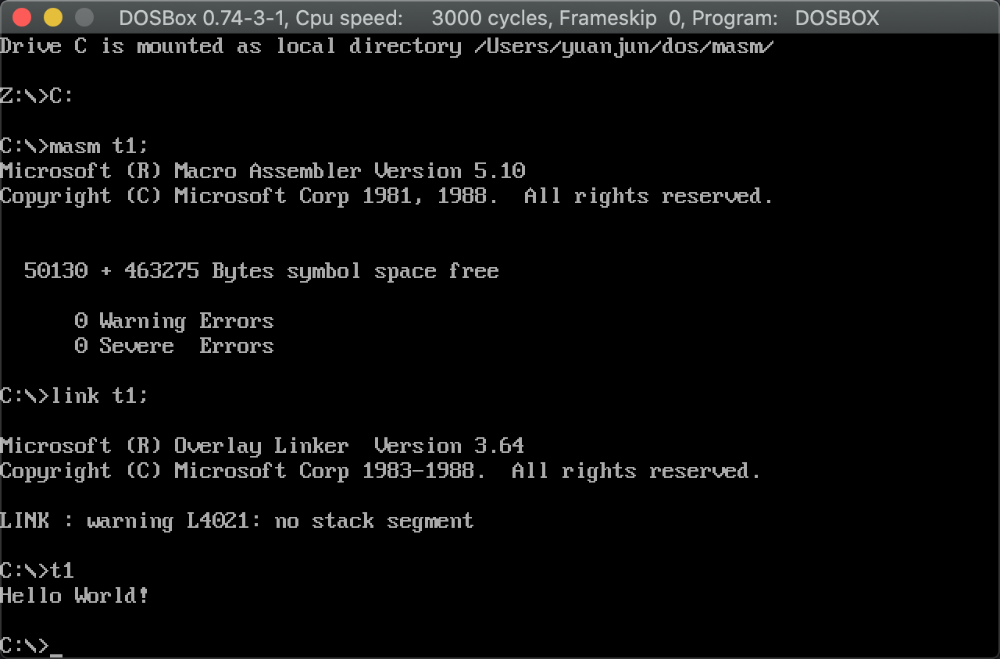

# 第0章：预备知识

## 0.1 工具DOSBOX和masm环境安装

* DosBox下载地址: [DosBox下载地址](https://www.dosbox.com/)
* debug下载地址: 链接: https://pan.baidu.com/s/1z4FaAchN24EwOWIXuXBQOw  密码: w35c

参考文章: [DOSBOX+masm环境搭建](https://juejin.im/post/6877222347187683341/)


汇编语言是直接在硬件之上工作的编程语言。


## 0.2 代码的编译和链接

将源代码生成最终的EXE文件，然后执行。

* Step 1: ~/dos/masm下创建t1.asm文件

> 文件内容：汇编书写的Hello World!

t1.asm代码如下：

```asm
;Hello World----from whatiwhere Ly
DATAS  SEGMENT
     STRING  DB  'Hello World!',13,10,'$'

DATAS  ENDS

CODES  SEGMENT
     ASSUME    CS:CODES,DS:DATAS
     
START:
     MOV  AX,DATAS
     MOV  DS,AX
     
     LEA  DX,STRING
     
     MOV  AH,9
     INT  21H 
               
     MOV  AH,4CH
     INT  21H
CODES  ENDS
    END   START
```

* Step 2: DosBox配置文件编译链接t1


```
yuanjun@bogon masm % vi ~/Library/Preferences/DOSBox\ 0.74-3-1\ Preferences 

masm t1;
link t1;
```

* Step 3: 打开DOSBOX，运行t1

发现masm文件夹下，多出了2个文件，分别是t1.EXT和t1.OBJ文件，打开DosBox运行t1，如下：



`注意：` 如果编译的文件有错误，是不会生成EXE和OBJ文件的。


