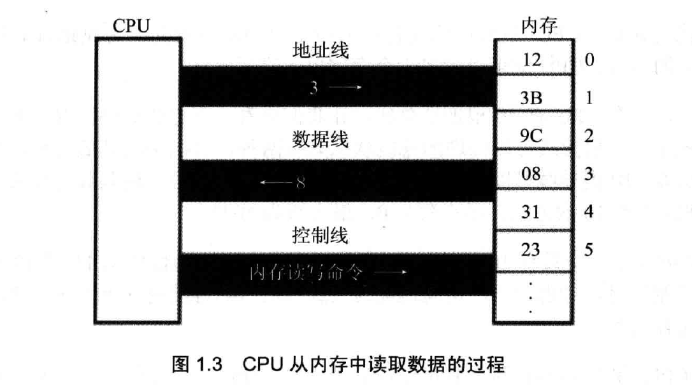
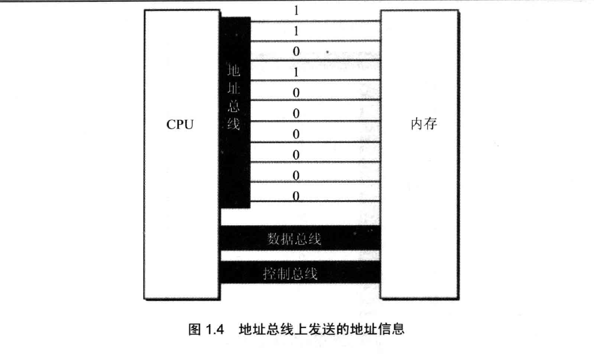
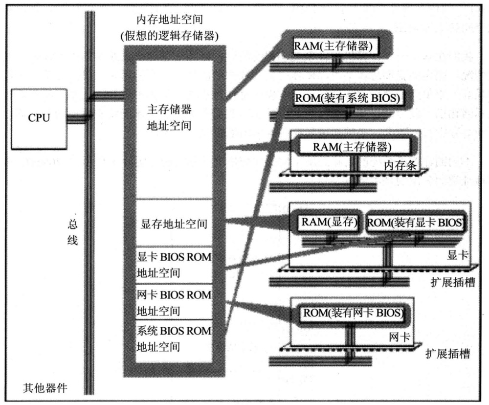
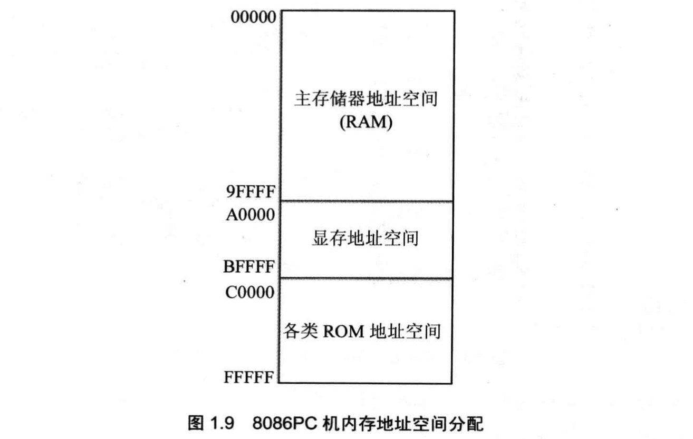

# 第1章: 基础知识

## 1.1 机器语言

**机器语言就是机器指令的集合，机器指令(一串二进制数字)就是机器能正确执行的命令。**


现在的PC机，都是用CPU来完成计算机功能，执行这一串机器指令。

## 1.2 汇编语言

**汇编语言是由汇编指令组成的，汇编指令是机器指令便于记忆的书写格式。**

例如，机器指令 1000100111011000 表示把寄存器BX的内容送到AX中，相当于汇编执行mov ax,bx.

```asm
操作: 寄存器BX内容送到AX中
机器指令：1000100111011000
汇编指令：mov ax,bx
```


**寄存器: CPU中的存储器件，一个CPU有多个寄存器。**


## 1.3 汇编语言的组成

汇编语言由3类指令组成:
* **汇编指令(核心)**: 机器码的助记符，有对应的机器码
* 伪指令: 没有对应的机器码，由编译器执行，计算机并不执行
* 其他符号: 没有对应的机器码，如+、-、*、/等，由编译器识别。


## 1.4 指令和数据

指令和数据时应用上的概念，在内存或磁盘上，指令和数据没有任何区别，都是二进制信息。

CPU工作时，把有的信息看做指令，有的信息看做数据，为同样的信息赋予了不同的意义。

## 1.5 CPU对存储器的读写

CPU通过地址总线、数据总线、控制总线对存储器进行读写。



**CPU从3号单元读取数据过程:**
(1).CPU通过地址总线将地址信息3发出
(2). CPU通过控制总线发出内存读命令，选中存储器芯片，并通知它，将要从中读取数据
(3). 存储器将3号单元中的数据8通过数据线送入CPU


## 1.6 地址总线

CPU通过地址总线来指定存储单元。地址总线的宽度决定了CPU的寻址能力。

N根地址总线的CPU能寻址0~(2^N - 1)个存储单元，也常称CPU的地址总线宽度为N。




`注意:` 如果地址总线有N根，但是内存却有大于2^N个bit，那么多余的内存将永远无法被访问到。


## 1.7 数据总线
CPU与内存或其他器件之间的数据传送是通过数据总线来进行的。数据总线的宽度决定了CPU和外界的数据传送速度。

N根数据线一次可传送N位二进制数据。

* 8086CPU数据总线宽度: 16
* 8088CPU数据总线宽度: 8


## 1.8 控制总线

CPU对外部器件的控制是通过控制总线来进行的。控制总线的宽度决定了CPU对外部器件的控制能力。

有多少根控制总线，就意味着CPU提供了对外部器件的多少种控制。

## 1.9 内存地址空间
举例: 一个CPU的地址总线宽度为10，那么可以寻址1024个内存单元，这1024个内存单元就构成了CPU的内存地址空间。

所有的物理存储被看做一个由若干存储单元组成的逻辑存储器，每个物理存储器在这个逻辑存储器中占有1个段地址空间。



### 8086PC机内存地址分配




* 从0~9FFFF的内存单元中读取数据，就是在读主随机存储器中的数据
* 向A0000~BFFFF的内存单元写数据，就是向显存中写数据，数据会被显示卡输出到显示器上
* 向C0000~FFFFF的内存单元写数据，是无效的，因为这等于改写只读存储器中的内容


